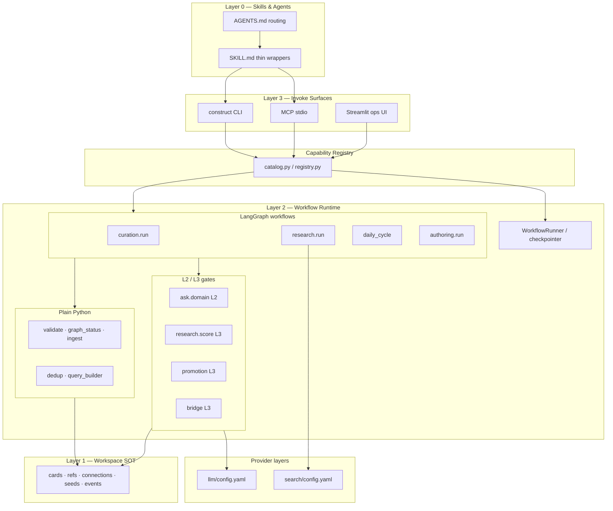

# CONSTRUCT v0.4 — Agent Workflows (LangGraph / LangChain) — Baseline Requirements Spec

**Version:** 0.4.0-baseline
**Date:** 2026-06-21
**Status:** Draft — baseline input for v0.4 phase planning
**Audience:** GSD phase planners, implementers, spec reviewers
**Prerequisite:** v0.3 shipped (capability registry, CLI, MCP, `ask.domain` L2 gate, Streamlit ops UI, workflow runner skeleton)

**Related (authoritative upstream):**

| Document | Role |
|----------|------|
| [adrs/adr-0003-v03-pipeline-v04-ui.md](adrs/adr-0003-v03-pipeline-v04-ui.md) | Layer model, LLM tiers (L1/L2/L3), invoke surfaces |
| [artifact-catalog.md](artifact-catalog.md) | Skill/workflow inventory; PIPE / LLM / HYB classification |
| [agent-spec-researcher.md](agent-spec-researcher.md) | Research cycle semantics (today Claude WebSearch) |
| [agent-spec-curator.md](agent-spec-curator.md) | Curation cycle semantics |
| [user-journeys.md](user-journeys.md) | J1 cold start, J2 daily cycle, J3 co-authorship |
| [prd-v03-pipeline-mvp.md](prd-v03-pipeline-mvp.md) | v0.3 binding patterns (registry, gates, events) |
| `.planning/milestones/v0.3-MILESTONE-AUDIT.md` | Accepted tech debt motivating this work |

**Supersedes (partially):** The v0.1/v0.3 assumption that research-cycle web search and multi-step skill orchestration remain Claude-native (`WebSearch` / `WebFetch` in SKILL.md). Skills remain Layer 0 *procedure authority*; Layer 2 becomes authoritative *how* for workflow execution.

---

## 1. Summary

v0.4 introduces **Python-orchestrated agent workflows** using **LangGraph** (multi-step state, human gates, resume) and **LangChain** (bounded LLM calls with structured output), replacing opaque Claude skill procedures for the highest-value multi-step journeys.

**Goals:**

1. **Model-agnostic runtime** — any invoke surface (CLI, MCP, Streamlit, future HTTP UI) runs the same workflow graphs; LLM and search providers swap via config.
2. **Testable contracts** — workflow steps, gate I/O, and provider responses are Pydantic-validated and covered by contract tests with mocked providers.
3. **Thin skills** — `CONSTRUCT-CLAUDE-impl/` skills delegate to CLI/MCP capabilities; they no longer perform web search or multi-step file orchestration inline.
4. **Human gates before SOT writes** — L2/L3 outputs require explicit review (Streamlit gate panel pattern from v0.3) before persisting cards, refs, connections, or promotions.

**Non-goals for this spec:** v0.5 browser-primary product UI (Layer 4), HTTP API, MCP SSE, cloud deploy, SQLite indexer.

---

## 2. Motivation

### 2.1 Why move skill workflows to LangGraph / LangChain

| Driver | Problem today | Target state |
|--------|---------------|--------------|
| **Model agnostic** | Research search uses Claude `WebSearch` / `WebFetch` — unavailable to Cursor-only agents, Ollama routes, or future non-Anthropic runtimes | Search and LLM gates run in Python with swappable providers |
| **Testability** | Skill procedures are prose in SKILL.md; regression depends on live agent sessions | Contract tests invoke registry handlers; graphs run with mocked LLM/search |
| **Orchestration fidelity** | v0.3 `curation-cycle` workflow steps are **placeholder no-ops** in `catalog.py` (WF-02/RT-04 tech debt) | Real step handlers wired through LangGraph or `WorkflowRunner` |
| **Gate discipline** | LLM judgment scattered across skill text (promotion, connection typing, relevance scoring) | Named L2/L3 gates with structured I/O, `review_required`, event logging |
| **Resume / progress** | `WorkflowRunner` + `workflow-state.json` exist but lack real step implementations | LangGraph checkpointing or persisted runner state across long workflows |
| **Provider independence** | ADR-0003 mandates config-driven LLM; search was explicitly deferred to Claude native in Phase 4 | Mirror `src/construct/llm/config.yaml` with `search` provider config |
| **v0.5 UI foundation** | UI buttons need stable invoke targets with schemas, progress, errors | Workflows exposed as capabilities: `research.run`, `curation.run`, etc. |

### 2.2 What stays Claude-native (not LangGraph)

Per ADR-0003 tier model — **do not** pull into Python:

| Tier | Examples | Rationale |
|------|----------|-----------|
| **L1 — user dialogue** | Domain-init interview, co-authorship editorial chat, session help conversation | Conversational UX belongs in chat/UI modals |
| **PIPE — deterministic** | Validate, graph-status, views-generate-data, ingest persistence, tag extraction (regex) | Plain Python — already correct |
| **Layer 0 specs** | SKILL.md procedure intent, artifact catalog | Authority for *what*; Python implements *how* |

Skills **remain** as deployable procedures but shrink to: classify intent → invoke capability → present results → optional gate review.

### 2.3 v0.3 starting point

Already implemented (reuse, extend):

- `src/construct/llm/ask_domain.py` — LangGraph L2 gate (`ask.domain`)
- `src/construct/pipelines/bridge_detect.py` — L1/L2 Python + L3 LangChain structured output
- `src/construct/pipelines/ingestion.py` — governed ingest with agent-supplied metadata flags
- `src/construct/pipelines/workflow_runner.py` — state persistence, resume
- `src/construct/capabilities/catalog.py` — registry, CLI/MCP exposure
- `src/construct/ui/gate_review.py` — approve/reject pattern for L2 outputs

---

## 3. Technology split — when LangGraph vs LangChain vs Python

| Pattern | Technology | Use when |
|---------|------------|----------|
| Multi-step workflow with state, branching, human interrupt, resume | **LangGraph** `StateGraph` | Curation cycle, research run, co-authorship pipeline, daily-cycle orchestrator |
| Single bounded judgment with structured output | **LangChain** (`ChatAnthropic` / provider factory + `with_structured_output(method="json_schema")`) | Connection type proposal, single-card promotion review, bridge L3 (today) |
| Rules, I/O, metrics, dedup, file writes | **Plain Python** | Integrity check, decay scan, dedup vs refs, ingest, event log, digest templates |

**Framework dependencies (existing):** `langgraph>=0.2`, `langchain-core>=0.3`, `langchain-anthropic>=1.1.0` in `pyproject.toml`. Provider factory must support OpenAI/Ollama per workspace routing without graph rewrites.

---

## 4. Workflow candidates

### 4.1 Priority matrix

| Priority | Workflow / capability | Framework | Rationale |
|----------|----------------------|-----------|-----------|
| **P0** | **Curation cycle** (`curation.run`) | LangGraph + L3 nodes | Placeholder steps today; blocks daily/cold-start honesty; clear PIPE/LLM split |
| **P0** | **Research run** (`research.run`) | LangGraph + search provider + L3 score gate | Removes Claude WebSearch coupling; enables model-agnostic acquisition |
| **P1** | **Research search** (`research.search`) | Python (+ Tavily provider) | Smallest slice to prove search abstraction before full run |
| **P1** | **Card evaluate gate** (`card.evaluate` / promotion L3) | LangChain or batched LangGraph | Feeds curation Step 4; isolated gate |
| **P2** | **Daily cycle orchestrator** (`workflow.daily_cycle` extend) | LangGraph parent graph | Composes research + curation + graph-status + views refresh |
| **P2** | **Gap analysis** (`gap.analyze`) | Python metrics + L2 narrative gate | Co-authorship and cold-start depend on it |
| **P3** | **Co-authorship** (`authoring.run`) | LangGraph multi-gate | Extends `ask.domain` → outline → draft → iterate → finalize |
| **P3** | **Synthesis** (`synthesis.draft`) | LangGraph or L2 chain | Retrieval via existing `ask.domain`; drafting/revision as gates |
| **P4** | **Cold start** (`onboarding.run`) | LangGraph composing sub-workflows | Mostly PIPE; domain interview stays L1 |
| **Defer** | Connection typing per edge | LangChain single-call | Can batch inside curation Step 5 |
| **Not LLM** | Tag extraction | Python regex | Explicit v0.3 decision — unchanged |

### 4.2 Workflow definitions (source skills)

| Workflow | Source | Current steps | Migration notes |
|----------|--------|---------------|-----------------|
| **Curation cycle** | `construct-curation-cycle` | 7 steps + views hook | Steps 1–3, 7 = PIPE; 4–5 = L3 gates; 6 = human interrupt |
| **Research cycle** | `construct-research-cycle` | 8 steps | Steps 1–2, 5, 7–8 = PIPE; 3 = search provider; 4 = L3 gate; 6 = digest (template or L2) |
| **Daily cycle** | `construct/workflows/daily-cycle.md` | research → curation → graph-status → user branch | Parent orchestrator; extend v0.3 skeleton |
| **Cold start** | `construct/workflows/cold-start.md` | init → domain-init → research → curation → status | Sub-workflow composition; domain-init interview = L1 only |
| **Co-authorship** | `construct/workflows/co-authorship.md` | gap → research? → synthesis → iterate → finalize | Highest LLM surface; build after research + gap |

### 4.3 Curation cycle — target graph topology

```text
START
  → integrity_check          [PIPE: workspace.validate]
  → decay_scan               [PIPE: governance rules + optional archive]
  → orphan_scan              [PIPE: connection counts; optional L3 borderline]
  → promotion_review         [L3 gate: card.evaluate batch]
  → connection_maintenance   [PIPE: bridge.detect + L3 per untyped edge]
  → process_inbox            [HUMAN: gate review queue]
  → compile_report           [PIPE: graph.status]
  → views_refresh_hook       [PIPE: views.generate_data if configured]
END
```

**Closes:** WF-02/RT-04 (curation no-op steps), integrates gate review before lifecycle/connection writes.

### 4.4 Research cycle — target graph topology

```text
START
  → load_config              [PIPE: search-seeds, domains, governance]
  → build_queries            [PIPE: clusters → query list with caps]
  → execute_search           [PIPE: SearchProvider — Tavily default]
  → deduplicate              [PIPE: vs refs/ + title fuzzy]
  → score_and_extract        [L3 gate: relevance, categories, findings]
  → gate_review              [HUMAN: approve batch before ingest]
  → ingest_batch             [PIPE: ingestion.ingest_source per finding]
  → compile_digest           [PIPE template + optional L2 narrative]
  → update_seeds_and_log     [PIPE: last_queried, events.jsonl]
  → views_refresh_hook       [PIPE: optional]
END
```

**Hybrid path (recommended near-term):** Agent may still trigger `research.run` via MCP; all search/score/ingest runs in Python. Agent role = scope negotiation + presenting digest, not `WebSearch`.

### 4.5 Co-authorship — target graph topology (P3)

```text
START
  → assess_readiness         [PIPE: gap metrics + L2 recommendations]
  → optional_research        [subgraph: research.run scoped]
  → retrieve_context         [L2: ask.domain]
  → outline_gate             [L3: structured outline → human approve]
  → draft_gate               [L3: draft with citations → human approve]
  → revision_loop            [HUMAN + L3: iterate until finalize]
  → publish                  [PIPE: write publish/ + events]
END
```

---

## 5. Architecture considerations

### 5.1 Layer model (unchanged intent, extended Layer 2)

```text
Layer 4  UI shell (v0.5+)           Buttons, wizards, gate modals → HTTP/CLI/MCP
Layer 3  Invoke surface             CLI · MCP · (future HTTP)
Layer 2  Python workflow runtime    LangGraph graphs + PIPE handlers + L2/L3 gates
Layer 1  Workspace SOT              cards/, refs/, connections.json, …
Layer 0  SKILL.md + catalog         Procedure intent; thin wrappers only
```

**Rule:** LangGraph does **not** replace Layer 0 catalog semantics or workspace schemas. Graph node names map to catalog capability IDs where possible.

### 5.2 Registry integration

- Every workflow entrypoint is a **`CapabilityRecord`** in `src/construct/capabilities/catalog.py`.
- CLI and MCP tools remain **1:1** with capability IDs (ADR-0003 A.1).
- Resolves **RT-01/RT-02** tech debt: views/spike/tag direct-import bypass is out of scope for this spec but workflows must register through `get_registry()`.
- Handlers return Pydantic **`OperationResult`** or gate-specific output models (matching `ask.domain` pattern).

### 5.3 Human-in-the-loop gates

Reuse v0.3 Streamlit **gate review** protocol (`src/construct/ui/gate_review.py`):

| Gate action | Event | SOT write |
|-------------|-------|-----------|
| Approve | `gate_review_approved` | Allowed — pipeline continues or commits batch |
| Reject | `gate_review_rejected` | Blocked — no ingest/promotion/connection write |

`review_required: true` on L2/L3 outputs by default (configurable per gate in YAML).

### 5.4 Config surfaces

Two new config domains alongside existing LLM config:

| Config file | Purpose |
|-------------|---------|
| `src/construct/llm/config.yaml` (existing) | LLM provider, model, gate tier assignments |
| **`src/construct/search/config.yaml` (new)** | Web search provider (Tavily default), API key env, rate/cost caps |
| `.construct/model-routing.yaml` (workspace) | Cognitive tier documentation; **must not** duplicate provider secrets |
| `.construct/governance.yaml` (workspace) | `max_papers_per_cycle`, relevance thresholds — consumed by research graph |

**Resolution order:** explicit CLI flag → env override (`CONSTRUCT_SEARCH_CONFIG`, `CONSTRUCT_LLM_CONFIG`) → repo default YAML.

### 5.5 Skill migration pattern (Layer 0)

For each migrated workflow skill:

1. Restrict `allowed-tools` to `Read, Bash(construct), MCP(connect)` — **remove `WebSearch`, `WebFetch`, `Write`, `Edit`** for research/curation.
2. Replace inline steps with documented CLI/MCP invocations.
3. Preserve INPUT/OUTPUT sections per Phase 4 migration convention.
4. LLM-judgment paragraphs become "invokes `{capability_id}` gate" references.

---

## 6. Data structures

### 6.1 Search — canonical `SearchResult`

Provider-agnostic normalized shape for all web/academic search adapters:

```python
class SearchResult(BaseModel):
    model_config = ConfigDict(extra="forbid")

    title: str
    url: str
    snippet: str                          # summary / abstract excerpt
    provider_score: float | None = None   # e.g. Tavily 0.0–1.0
    raw_content: str | None = None      # optional full page (markdown)
    published_date: str | None = None   # ISO date if known
    source_domain: str
    query: str                            # originating query string
    cluster_id: str | None = None       # search-seeds cluster
    provider: str                         # "tavily" | "brave" | "arxiv" | ...
```

**Tavily mapping:** `title`, `url`, `content` → `snippet`, `score` → `provider_score`, `raw_content` when `include_raw_content="markdown"`.

### 6.2 Search — batch response

```python
class SearchBatchOutput(BaseModel):
    query: str
    results: list[SearchResult]
    provider: str
    response_time_ms: float | None = None
    truncated: bool = False               # hit governance cap
```

### 6.3 Research — L3 score/extract gate output

```python
class ScoredFinding(BaseModel):
    model_config = ConfigDict(extra="forbid")

    search_result_url: str
    relevance_score: float = Field(ge=0.0, le=1.0)
    source_tier: int = Field(ge=1, le=5)
    key_findings: list[str] = Field(max_length=5)
    content_categories: list[str]
    ingest_action: Literal["skip", "ref_only", "ref_and_card"]
    reasoning: str | None = None
```

```python
class ResearchScoreGateOutput(BaseModel):
    findings: list[ScoredFinding]
    gate: GateMetadata                      # reuse ask.domain pattern
    retrieval: dict                         # counts: considered, selected, skipped
```

Thresholds from `governance.yaml`: `relevance_threshold`, `card_creation_threshold`, `max_papers_per_cycle`.

### 6.4 Curation — L3 promotion gate output

```python
class PromotionDecision(BaseModel):
    card_id: str
    decision: Literal["promote", "hold", "escalate"]
    target_lifecycle: Literal["growing", "mature"] | None = None
    reasoning: str
    method: Literal["rule-based", "llm-judgment"]
```

### 6.5 Workflow — persisted runner state

Extend existing `workflow-state.json` schema (via `WorkflowRunner`) or LangGraph checkpointer:

```python
class WorkflowRunState(BaseModel):
    workflow_name: str
    workflow_version: str = "1.0"
    status: Literal["running", "paused", "failed", "completed", "awaiting_review"]
    current_step: str
    completed_steps: list[str]
    gate_queue: list[dict]                  # pending human reviews
    started_at: str                         # ISO-8601
    updated_at: str
    error: str | None = None
```

### 6.6 Events

Append to `log/events.jsonl` (existing format). New event types:

| Event | When |
|-------|------|
| `research_search_complete` | After search provider batch |
| `research_score_gate_complete` | After L3 scoring (pre-ingest) |
| `research_cycle_complete` | After full `research.run` |
| `curation_cycle_complete` | After full `curation.run` |
| `gate_review_approved` / `gate_review_rejected` | Human gate (existing protocol) |
| `workflow_step_complete` | Per-step progress (existing runner) |

---

## 7. Architecture overview

### 7.1 System diagram



### 7.2 Research path — decoupling WebSearch

```text
  BEFORE (v0.3)                         AFTER (v0.4 target)

  Claude WebSearch/WebFetch             search/config.yaml → Tavily (default)
         │                                        │
         ▼                                        ▼
  Agent extracts/scores                 LangGraph: dedup → score L3 gate
         │                                        │
         ▼                                        ▼
  construct ingest (Python)             gate review → ingest (Python)
         │                                        │
         ▼                                        ▼
  Workspace SOT                         Workspace SOT
```

---

## 8. Web search provider considerations

### 8.1 Motivation to leave Claude WebSearch

| Issue | Impact |
|-------|--------|
| Anthropic runtime lock-in | Non-Claude agents cannot run research cycle |
| Untestable in CI | No contract tests against search results |
| Opaque result shape | Hard to normalize into `refs/*.json` schema |
| WebFetch duplication | Tavily `include_raw_content` or dedicated extract API replaces fetch |

Phase 4 explicitly preserved WebSearch in skills ("cannot be replaced by CLI") — **this spec supersedes that decision** for v0.4 workflow migration.

### 8.2 Provider evaluation

| Provider | Role | Notes |
|----------|------|-------|
| **Tavily** | **Default general web search** | Python SDK; structured JSON; snippet + optional markdown; relevance score; time filters; fits RAG/agent pipelines |
| **Tavily MCP** | Optional adjunct | Do not bypass registry — wrap in Python provider for CLI/MCP parity |
| **Brave Search API** | Alternative general web | Privacy-focused; referenced in archive design examples |
| **Exa / Serper** | Alternative | Same `SearchProvider` interface slot |
| **arXiv / Semantic Scholar** | Academic complement | v0.1 Python used dedicated APIs; recommended as second provider for paper metadata (authors, venue, DOI) |
| **Claude WebSearch** | Migration fallback only | Remove from skill `allowed-tools` when `research.run` ships |

### 8.3 Search provider interface

```python
class SearchProvider(Protocol):
    def search(
        self,
        query: str,
        *,
        max_results: int,
        cluster_id: str | None = None,
        time_range: str | None = None,
        include_raw_content: bool = False,
    ) -> SearchBatchOutput: ...
```

Factory reads `search/config.yaml` → `type: tavily | brave | arxiv | ...` and `api_key_env`.

### 8.4 Governance and cost guards

From workspace `governance.yaml` (existing fields + recommended):

| Control | Default source | Purpose |
|---------|----------------|---------|
| `max_papers_per_cycle` | governance | Cap ingested items per run |
| `max_queries_per_cycle` | search config | Cap API calls |
| `relevance_threshold` | governance | Skip below threshold before ingest |
| `card_creation_threshold` | governance | ref-only vs ref+card |
| Provider rate limits | search provider | Retry/backoff; surface degraded state in digest |

Daily-cycle error handling (existing workflow doc): **web search fails → continue with partial results, report degraded state**.

---

## 9. Capabilities — proposed registry entries

### 9.1 New capabilities (v0.4 workflow tranche)

| Capability ID | CLI (proposed) | MCP tool (proposed) | Layer | LLM | Priority |
|---------------|----------------|---------------------|-------|-----|----------|
| `research.search` | `construct research search` | `construct_research_search` | PIPE | — | P1 |
| `research.run` | `construct research run` | `construct_research_run` | HYB | L3 gate | P0 |
| `research.score` | internal or `construct research score` | `construct_research_score` | L3 | LangGraph/LC | P1 |
| `curation.run` | `construct curation run` | `construct_curation_run` | HYB | L3 gates | P0 |
| `card.evaluate` | `construct card evaluate` | `construct_card_evaluate` | L3 | LangChain | P1 |
| `gap.analyze` | `construct gap analyze` | `construct_gap_analyze` | HYB | L2 | P2 |
| `authoring.run` | `construct authoring run` | `construct_authoring_run` | HYB | L2/L3 | P3 |
| `workflow.daily_cycle` | extend existing | extend existing | PIPE+HYB | optional | P2 |

### 9.2 Existing capabilities — reused inside graphs

| ID | Use inside |
|----|------------|
| `workspace.validate` | Curation step 1 |
| `graph.status` | Curation report; daily cycle |
| `views.generate_data` | Post-workflow hooks |
| `ask.domain` | Synthesis / co-authorship retrieval |
| `bridge.detect` | Curation connection maintenance |
| `ingest.source` | Research ingest batch (via `ingestion.ingest_source`) |

### 9.3 Repository targets (proposed)

| Component | Path |
|-----------|------|
| Search providers | `src/construct/search/` |
| Search config | `src/construct/search/config.yaml` |
| Research pipeline / graph | `src/construct/pipelines/research.py`, `src/construct/llm/research_score.py` |
| Curation pipeline / graph | `src/construct/pipelines/curation.py`, `src/construct/llm/promotion_review.py` |
| Authoring graph | `src/construct/llm/authoring.py` |
| Workflow composition | `src/construct/pipelines/workflow_runner.py` (extend) |
| Contract tests | `tests/contract/test_research_*.py`, `tests/contract/test_curation_*.py` |
| Fixtures | `tests/fixtures/search/` (mock Tavily JSON) |

---

## 10. Scope

### 10.1 In scope (v0.4 workflow tranche)

- Search provider abstraction with **Tavily** as default implementation
- `research.search` and `research.run` with L3 score gate and gate review before ingest
- `curation.run` replacing placeholder workflow steps with real PIPE + L3 handlers
- Skill migrations for `construct-research-cycle` and `construct-curation-cycle` (thin wrappers)
- MCP + CLI parity for all new capabilities
- Contract tests with mocked search and LLM providers
- Streamlit gate review support for research batch and curation promotion queue
- Event logging per Section 6.6
- Documentation updates to `artifact-catalog.md` (C03 target class confirmations)

### 10.2 Out of scope (defer)

- HTTP API for browser UI (v0.5 UI shell — separate milestone)
- MCP SSE / remote transport
- Full co-authorship graph (P3 — after research + curation stable)
- SQLite indexer / FTS dedup (file-based dedup sufficient for v0.4 baseline)
- Cloud deploy
- Replacing L1 conversational domain-init interview with LangGraph
- Tag extraction LLM upgrade (remains regex)
- `views.generate_data` full emission (ADV-03 — separate track)
- RT-01/RT-02 registry unification for views/spike/tag CLI groups

### 10.3 Acceptance criteria (baseline — phase planning input)

1. **`research.search`** returns normalized `SearchResult` list from Tavily with mocked contract tests passing without network.
2. **`research.run`** on `test-ws/my-construct/` executes search → score → gate → ingest path; updates `search-seeds.json` `last_queried`; emits `research_cycle_complete`.
3. **`curation.run`** replaces all seven placeholder handlers; integrity step calls real validate; promotion step invokes L3 gate; no silent no-ops.
4. **Skills** `construct-research-cycle` and `construct-curation-cycle` contain **no** `WebSearch` / `WebFetch` in `allowed-tools`.
5. **MCP** exposes new tools with schemas matching CLI kwargs (RT-03 parity pattern).
6. **Provider swap:** change `search/config.yaml` provider block → different adapter loads without graph code change (Tavily → mock provider in tests required; second real provider optional).
7. **LLM provider swap:** score gate uses `llm/config.yaml` — not hardcoded Anthropic-only import paths in graph nodes (factory pattern).
8. Test suite growth: all existing 228 tests pass; new contract tests for each capability.

---

## 11. Risks and mitigations

| Risk | Severity | Mitigation |
|------|----------|------------|
| Tavily cost / quota exhaustion | Medium | Query caps, `max_papers_per_cycle`, cluster weights; degraded partial results |
| Weak academic metadata from general search | Medium | Hybrid arXiv/S2 provider phase; L3 extraction from `raw_content` |
| Dual config confusion (`model-routing.yaml` vs `search.yaml` vs `llm/config.yaml`) | Medium | Document ownership in spec + USER_GUIDE; validation warns on conflict |
| Migration breaks Claude-only users mid-transition | Medium | Feature flag or skill version note; keep fallback doc until `research.run` stable |
| LangGraph complexity vs WorkflowRunner duplication | Medium | Start curation on WorkflowRunner with real handlers; introduce LangGraph where interrupts/checkpointing required; converge in one orchestration module |
| Gate review UX gap in CLI-only sessions | Low | CLI emits JSON queue; user re-runs with `--approve-batch`; Streamlit optional |
| Over-migrating L1 dialogue to Python | High | Explicit tier guardrails in phase plans — reject domain-init/co-authorship chat graphs in P0/P1 |
| Ingest still URL-stub without raw_content | Medium | Pass Tavily `raw_content` into score gate; ingest metadata flags (already implemented) |
| Model deprecation (LangChain/Anthropic) | Low | Pin versions; `method="json_schema"`; monitor provider factory |

---

## 12. Phased next steps (for GSD phase planning)

Recommended phase breakdown for `/gsd-new-milestone` or `/gsd-plan-phase`:

| Phase | Name | Deliverables | Depends on |
|-------|------|--------------|------------|
| **W1** | Search provider spine | `SearchResult`, Tavily adapter, `search/config.yaml`, `research.search` CLI/MCP, mocked tests | v0.3 registry |
| **W2** | Research score gate | L3 `research.score`, Pydantic gate I/O, LangGraph or LC batch scorer | W1 |
| **W3** | Research run workflow | Full `research.run` graph, digest, seed updates, skill migration (remove WebSearch) | W1, W2 |
| **W4** | Curation PIPE steps | Real integrity/decay/orphan/report handlers (Python only) | v0.3 validate, knowledge CLI |
| **W5** | Curation L3 gates | Promotion + connection typing gates, `curation.run` graph, skill migration | W4, card.evaluate |
| **W6** | Daily cycle composition | Extend `workflow.daily_cycle` to call research + curation subgraphs | W3, W5 |
| **W7** | Gap + authoring (optional) | `gap.analyze`, `authoring.run` skeleton | W3, ask.domain |

**Immediate planning artifacts to produce:**

1. Update [artifact-catalog.md](artifact-catalog.md) — new capability rows, C03 target class for research/curation = `PIPE` + `LLM` gates.
2. Phase PRD per tranche (e.g. `prd-v04-research-workflow.md`) with JSON schemas copied from Section 6.
3. AI-SPEC for L3 gates (eval dimensions, failure modes) per `/gsd-ai-integration-phase` convention.
4. Nyquist / contract test matrix per capability.
5. USER_GUIDE + `construct-research-cycle` / `construct-curation-cycle` SKILL.md migrations in `CONSTRUCT-CLAUDE-impl/`.

**Operator sequencing:** W1 → W2 → W3 delivers model-agnostic research (highest user-visible win). W4 → W5 closes curation placeholder debt. W6 wires daily/cold-start journeys.

---

## 13. Traceability

| User journey | Workflow | v0.4 capability |
|--------------|----------|-----------------|
| J1 Cold start step 3–4 | research + curation | `research.run`, `curation.run` |
| J2 Daily use step 2–3 | research + curation | `workflow.daily_cycle` |
| J2 step 6 URL add | card-create / ingest | unchanged (`ingest.source`) |
| J3 Co-authorship step 3–4 | gap + research + synthesis | `gap.analyze`, `research.run`, `authoring.run` (P3) |

| v0.3 tech debt | Addressed by |
|----------------|--------------|
| WF-02/RT-04 curation no-ops | W4, W5 |
| Claude WebSearch lock-in | W1, W3 |
| RT-01/RT-02 registry bypass | Out of scope (separate phase) |
| ADV-03 views emission | Out of scope |
| CR-02 help.py layout | Out of scope |

---

## 14. Open questions (for discuss-phase)

1. **LangGraph vs WorkflowRunner first?** — Implement W4 with runner only, or require LangGraph from W4 for uniform checkpointing?
2. **Academic provider in W1 or W3?** — Tavily-only MVP vs dual provider from start?
3. **Gate review in CLI** — JSON approve file, interactive prompt, or Streamlit-only until v0.5 UI baseline?
4. **Digest generation** — deterministic template only, or L2 narrative gate by default?
5. **Workspace-level search config** — allow `.construct/search.yaml` override per domain workspace?

---

## 15. Document history

| Date | Change |
|------|--------|
| 2026-06-21 | Initial baseline — consolidated from v0.4 workflow / LangGraph / search provider design discussion |

---

*This document is input to v0.4 GSD phase planning. It does not supersede [ADR-0003](adrs/adr-0003-v03-pipeline-v04-ui.md) layer semantics or [data-schemas.md](data-schemas.md) workspace formats. Implementation bindings (exact CLI flags, JSON Schema exports) belong in per-phase PRDs derived from this spec.*
